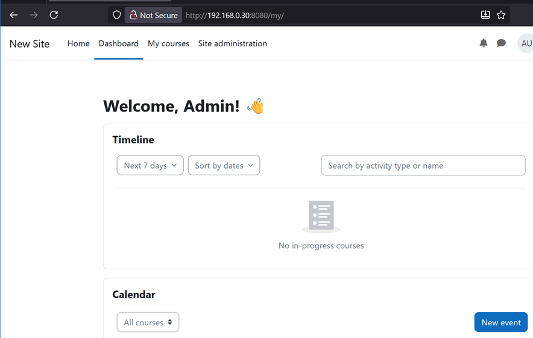
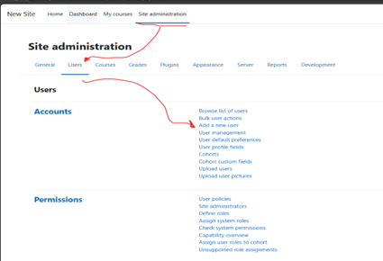
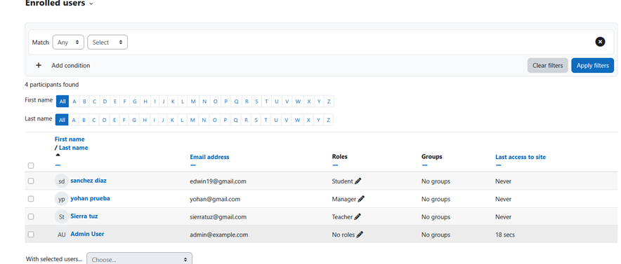
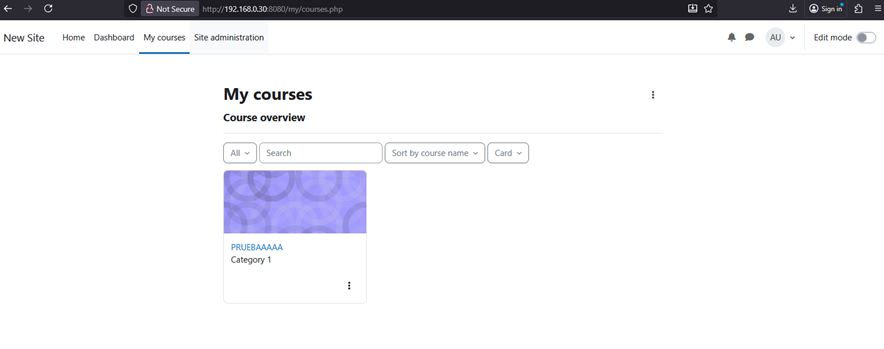
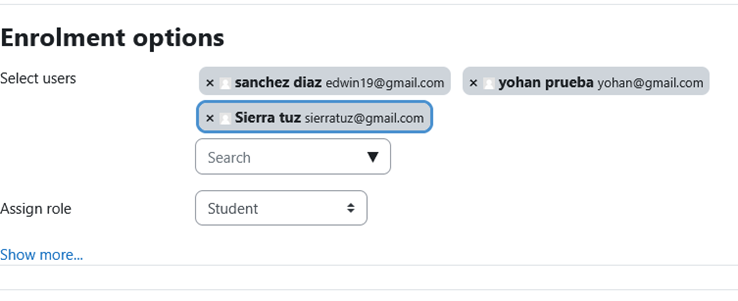
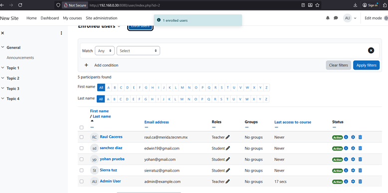

# Moodle + MariaDB (Docker Compose)

Implementación de **Moodle** (plataforma de aprendizaje en línea) usando **Docker Compose** con base de datos **MariaDB**.

---

## 📁 Estructura del proyecto

```
prueba/
├── docker-compose.yml     # Archivo principal de configuración
├── php.ini                # Config opcional (si se copia del contenedor)
└── README.md              # Documentación del proyecto
```

---

## ⚙️ 1. Configuración del archivo `docker-compose.yml`

Copia y pega lo siguiente dentro del archivo `docker-compose.yml`:

```yaml
version: "3.8"

services:
  mariadb:
    image: bitnami/mariadb:latest
    environment:
      - MARIADB_ROOT_PASSWORD=12345
      - MARIADB_DATABASE=jm_base
      - MARIADB_USER=jm
      - MARIADB_PASSWORD=1234
      - MARIADB_CHARACTER_SET=utf8mb4
      - MARIADB_COLLATE=utf8mb4_unicode_ci
    volumes:
      - 'mariadb_data:/bitnami/mariadb'

  moodle:
    image: docker.io/bitnamilegacy/moodle:4.3
    depends_on:
      - mariadb
    ports:
      - '8080:8080'
      - '8443:8443'
    environment:
      - MOODLE_DATABASE_HOST=mariadb
      - MOODLE_DATABASE_PORT_NUMBER=3306
      - MOODLE_DATABASE_NAME=jm_base
      - MOODLE_DATABASE_USER=jm
      - MOODLE_DATABASE_PASSWORD=1234
      - MOODLE_USERNAME=admin
      - MOODLE_PASSWORD="Admin123!"
      - MOODLE_EMAIL=admin@example.com
    volumes:
      - 'moodle_data:/bitnami/moodle'
      - 'moodledata_data:/bitnami/moodledata'

volumes:
  mariadb_data:
    driver: local
  moodle_data:
    driver: local
  moodledata_data:
    driver: local
```

---

## 🚀 2. Levantar el entorno

Ejecuta los siguientes comandos desde la carpeta del proyecto:

```bash
docker compose up -d
docker ps
```

Cuando ambos contenedores estén activos (mariadb y moodle), abre en tu navegador:

👉 [http://localhost:8080](http://localhost:8080)
o
👉 http://<IP_del_servidor>:8080

🧠 Usuario por defecto:

* Usuario: **admin**
* Contraseña: **Admin123!**

---

## ⚒️ 3. Modificación del archivo php.ini

📍 Ubicación dentro del contenedor:

```
/opt/bitnami/php/etc/php.ini
```

📤 Copiar desde el contenedor a tu máquina (backup):

```bash
docker cp prueba-moodle-1:/opt/bitnami/php/etc/php.ini .
mv php.ini old-php.ini
```

📝 Editar parámetros recomendados:

```ini
upload_max_filesize = 100M
post_max_size = 100M
max_execution_time = 300
```

📥 Subir el archivo de nuevo al contenedor:

```bash
docker cp php.ini prueba-moodle-1:/opt/bitnami/php/etc/php.ini
docker restart prueba-moodle-1
```

💡 También puedes entrar directamente:

```bash
docker exec -it prueba-moodle-1 bash
nano /opt/bitnami/php/etc/php.ini
```

---

## 🎓 4. Configuración inicial en Moodle

Inicia sesión con el usuario administrador.





Desde el panel principal, selecciona “My Courses” → “Create Course”.


Completa los datos del curso y guarda.

---

## 👥 5. Gestión de usuarios y roles

➕ **Crear un nuevo usuario:**
[Guía rápida de Moodle](https://docs.moodle.org/400/en/Admin_quick_guide)


Ir a *Site administration → Users → Add a new user*



Completar los datos y guardar.

🧩 **Asignar roles:**
Entra a *Home → Participants*


Edita el usuario y asigna un rol (Teacher, Student, etc.)


---

## 📚 6. Inscribir usuarios a un curso

Accede al curso desde *My Courses*.


Ve a *Participants → Enrol users.*


Selecciona los usuarios y define su rol.

Guarda con **Enrol users**.

---

## ✍️ Autor

**Brayan Sierra**
📘 *Proyecto: Moodle en Docker con MariaDB*
🖥️ *Sistema base: Ubuntu Server 22.04*
📅 *Fecha: 2025-11-12*
